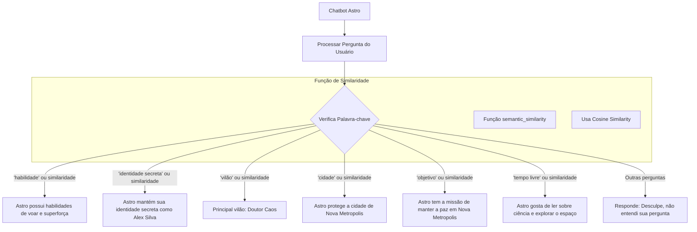

# Documentação do Chatbot "Astro"

## Descrição Geral

O Chatbot Astro é um assistente baseado em processamento de linguagem natural (PLN) que responde a perguntas sobre o personagem fictício Astro, um super-herói protetor da cidade de Nova Metropolis. Utilizando a biblioteca **NLTK** para processamento de texto, o chatbot é capaz de interpretar perguntas dos usuários sobre a história, habilidades e missão de Astro, além de informações sobre seus vilões, identidade secreta e hobbies.

## Requisitos de Instalação

### Pré-requisitos

Para executar o chatbot, você precisa ter o Python instalado em sua máquina. As seguintes bibliotecas também devem ser instaladas:

-   **NLTK**: Biblioteca usada para processamento de linguagem natural.
-   **scikit-learn** (opcional): Para implementar a função de similaridade semântica.

### Instalando as dependências

Use o seguinte comando para instalar as dependências:

```bash
`pip install nltk scikit-learn` 
```
### Executando o Chatbot

1.  Abra o terminal ou PowerShell na pasta do projeto.
2.  Execute o arquivo `chatbot.py` usando o comando:

```bash
`python chatbot.py`
``` 

3.  O chatbot estará pronto para receber perguntas e fornecer respostas.

## Estrutura do Código

### Imports Necessários

```python
`import nltk
from sklearn.metrics.pairwise import cosine_similarity
from sklearn.feature_extraction.text import CountVectorizer` 
```
O código importa a biblioteca NLTK para processamento de linguagem e scikit-learn para calcular a similaridade semântica das perguntas.

### Função de Similaridade Semântica

A função `semantic_similarity` é usada para melhorar a compreensão do chatbot, permitindo que ele entenda perguntas similares ao conteúdo esperado.

```python
`def semantic_similarity(user_input, keywords):
    vectorizer = CountVectorizer().fit_transform([user_input] + keywords)
    vectors = vectorizer.toarray()
    similarity_matrix = cosine_similarity(vectors)
    return similarity_matrix[0][1] > 0.5` 
```
### Lógica Principal

A lógica principal do chatbot está dentro de um loop que processa o input do usuário, identifica palavras-chave e responde com base nas informações sobre o personagem Astro.

#### Exemplo de Condicionais para Resposta:

```python
`if 'habilidade' in user_input or semantic_similarity(user_input, ['habilidade', 'poderes', 'superforça', 'voar']):
    response = "Astro possui a habilidade de voar e tem superforça, o que o ajuda a combater o crime em Nova Metropolis."
elif 'vilão' in user_input or semantic_similarity(user_input, ['vilão', 'doutor caos', 'inimigo']):
    response = "O principal vilão de Astro é o Doutor Caos, um gênio do mal que tenta controlar Nova Metropolis."
else:
    response = "Desculpe, não entendi sua pergunta. Pergunte sobre Astro, seus poderes ou sua história!"` 
```
### Perguntas Compreendidas pelo Chatbot

1.  **Habilidades do Astro:**
    
    -   Quais são as habilidades de Astro?
    -   Astro tem superforça?
2.  **Identidade secreta:**
    
    -   Quem é Alex Silva?
    -   Qual é a identidade secreta de Astro?
3.  **Vilões:**
    
    -   Quem é o Doutor Caos?
    -   Quem é o vilão do Astro?
4.  **Cidade protegida:**
    
    -   Onde o Astro mora?
    -   Qual é a cidade do Astro?
5.  **Objetivo:**
    
    -   Qual é a missão do Astro?
6.  **Tempo Livre:**
    
    -   O que Astro faz nas horas vagas?

### Respostas Padrão

O chatbot possui respostas fixas que são fornecidas com base nas perguntas feitas pelo usuário. Por exemplo:

-   Se o usuário perguntar sobre as habilidades do Astro, a resposta será:  
    _"Astro possui a habilidade de voar e tem superforça, o que o ajuda a combater o crime em Nova Metropolis."_
    
-   Se o usuário perguntar sobre seu inimigo, a resposta será:  
    _"O principal vilão de Astro é o Doutor Caos, um gênio do mal que tenta controlar Nova Metropolis."_
    
-   Para perguntas não reconhecidas, o chatbot retorna:  
    _"Desculpe, não entendi sua pergunta. Pergunte sobre Astro, seus poderes ou sua história!"_
    

## Melhorias Futuras

1.  **Expansão do Banco de Dados de Perguntas:** O chatbot pode ser aprimorado com um conjunto maior de perguntas e respostas para cobrir mais detalhes sobre Astro.
2.  **Melhoria da Similaridade Semântica:** Aprimorar a função de similaridade para interpretar melhor variações complexas nas perguntas dos usuários.
3.  **Integração com API Externa:** Para futuras melhorias, o chatbot pode se integrar a APIs para buscar informações mais dinâmicas sobre o personagem ou sobre outros tópicos.

## Conclusão

Este chatbot é uma solução simples para responder a perguntas sobre o personagem Astro, utilizando processamento de linguagem natural para identificar o tema de cada pergunta e fornecer uma resposta apropriada. Ele pode ser expandido conforme necessário para incluir mais informações e melhorar a interação com o usuário.

